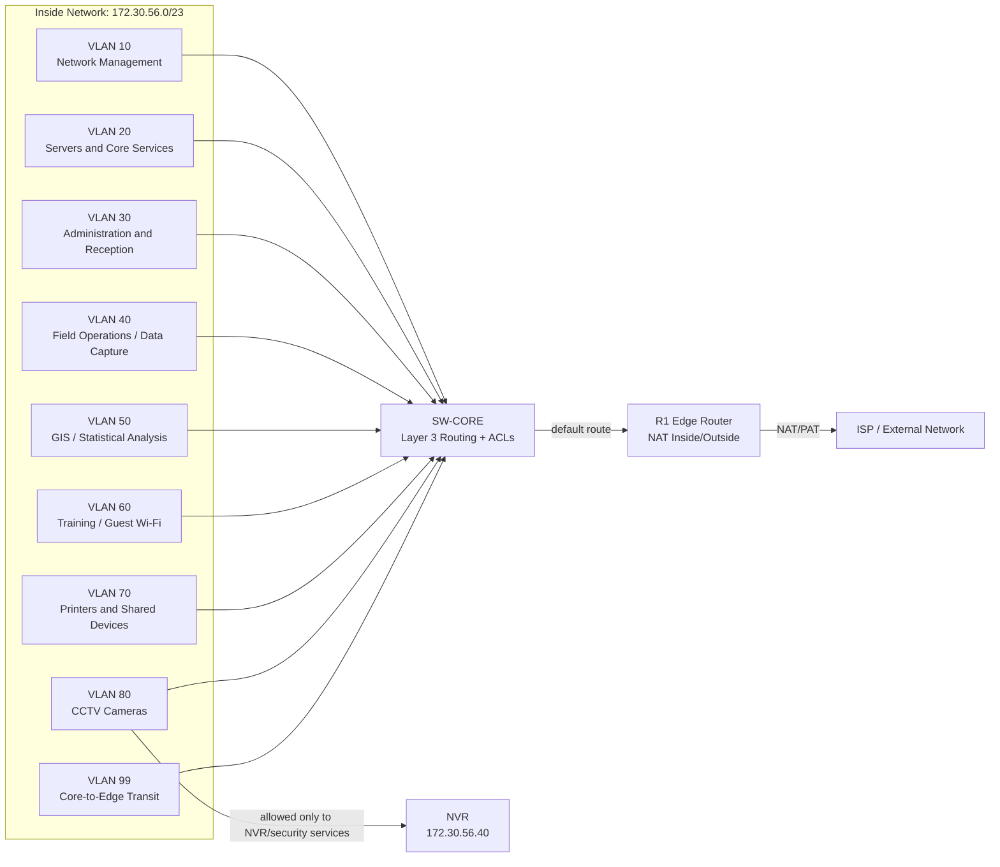

# Logical Topology

## Proposed Logical Design

## VLAN Plan

| VLAN | Name | Purpose |
| --- | --- | --- |
| 10 | Network Management | Switch/router management interfaces and authorized admin access. |
| 20 | Servers and Core Services | DHCP, DNS, file/app services, and CCTV NVR. |
| 30 | Administration and Reception | Office administration, reception, and management users. |
| 40 | Field Operations / Data Capture | Field operations and data capture users. |
| 50 | GIS / Statistical Analysis | Analysts and specialist statistics/GIS workstations. |
| 60 | Training / Guest Wi-Fi | Controlled wireless or temporary training access. |
| 70 | Printers and Shared Devices | Network printers and other shared peripherals. |
| 80 | CCTV Cameras | Segmented IP camera network. |
| 99 | Core-to-Edge Transit | Routed link between SW-CORE and R1. |

## Routing

- SW-CORE provides default gateways using switched virtual interfaces.
- SW-CORE performs inter-VLAN routing for internal VLANs.
- SW-CORE forwards internet-bound traffic to R1 using a default route.
- R1 has a return route to `172.30.56.0/23` through SW-CORE.
- R1 performs NAT/PAT for inside users.

## NAT Design

- NAT inside scope: `172.30.56.0/23`
- NAT outside interface: R1 ISP-facing interface
- Method: PAT/overload for internal users sharing the simulated public R1 address
- Purpose: Demonstrate inside/outside translation and allow internal users to reach the external test network

## Logical Security Policy

| Source | Destination | Policy |
| --- | --- | --- |
| Management VLAN | Network devices | Permit SSH/HTTPS from authorized admin hosts only. |
| User VLANs | Servers | Permit required office services such as DNS, DHCP, file/app access. |
| User VLANs | Internet | Permit through R1 NAT/PAT. |
| CCTV VLAN | NVR/security services | Permit required CCTV traffic. |
| CCTV VLAN | User VLANs | Deny. |
| CCTV VLAN | Internet | Deny by default unless a specific update/NTP requirement is approved. |
| Guest/Training VLAN | Internal networks | Deny except DHCP/DNS if provided internally. |
| Guest/Training VLAN | Internet | Permit through NAT/PAT. |

