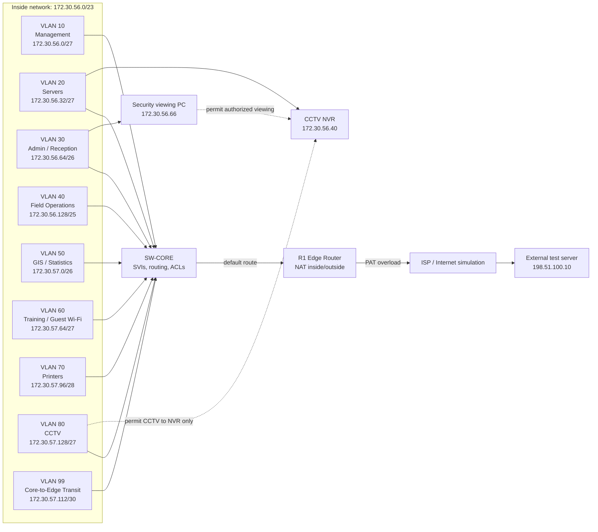

# Logical Topology

Project name: **Stats SA Mafikeng Field Office (Mahikeng)**

## Logical Design

## VLAN Plan

| VLAN | Name | Purpose | Gateway |
| --- | --- | --- | --- |
| 10 | Network Management | Router, switch, and AP management interfaces. | `172.30.56.1` |
| 20 | Servers and Core Services | DHCP, DNS, file/app services, and CCTV NVR. | `172.30.56.33` |
| 30 | Administration and Reception | Office admin, reception, and authorized security viewing workstation. | `172.30.56.65` |
| 40 | Field Operations / Data Capture | Main operational users who capture and process field data. | `172.30.56.129` |
| 50 | GIS / Statistical Analysis | Specialist users who need reliable access to internal services. | `172.30.57.1` |
| 60 | Training / Guest Wi-Fi | Temporary or non-sensitive wireless access. | `172.30.57.65` |
| 70 | Printers and Shared Devices | Shared printers and small office network devices. | `172.30.57.97` |
| 80 | CCTV Cameras | IP cameras added by the change request. | `172.30.57.129` |
| 99 | Core-to-Edge Transit | Routed link between SW-CORE and R1. | Point-to-point |

## Routing Design

| Route type | Location | Detail |
| --- | --- | --- |
| Inter-VLAN routing | SW-CORE | SVIs provide gateways for VLANs 10, 20, 30, 40, 50, 60, 70, and 80. |
| Default route | SW-CORE | `0.0.0.0/0` points to R1 inside interface `172.30.57.114`. |
| Return route | R1 | Route back to `172.30.56.0/23` through SW-CORE `172.30.57.113`. |
| Outside route | R1 | Default route points to ISP router `203.0.113.1`. |

## NAT Inside/Outside Design

| NAT item | Design value |
| --- | --- |
| NAT inside networks | `172.30.56.0/23` |
| NAT inside interface | R1 interface facing SW-CORE, `172.30.57.114` |
| NAT outside interface | R1 interface facing ISP, `203.0.113.2` |
| NAT method | PAT overload |
| NAT ACL wildcard | `permit 172.30.56.0 0.0.1.255` |
| Verification target | External test server `198.51.100.10` |

The reason for using PAT overload is that many internal devices can share one simulated outside address. This matches a normal small-office edge design and gives a clear way to demonstrate the assigned NAT challenge in Packet Tracer.

## Logical Security Policy

| Source | Destination | Policy | Reason |
| --- | --- | --- | --- |
| Management VLAN | Router and switches | Permit SSH from authorized admin hosts. | Prevents casual or accidental access to device administration. |
| User VLANs | Servers | Permit required services such as DNS, DHCP, file/app, and NVR viewing where authorized. | Supports normal office work. |
| User VLANs | Internet | Permit through R1 NAT/PAT. | Allows external access while hiding internal addresses. |
| CCTV VLAN | NVR `172.30.56.40` | Permit required camera/NVR traffic. | Required for recording and monitoring. |
| CCTV VLAN | User VLANs | Deny. | Satisfies the CCTV segmentation change request. |
| CCTV VLAN | Internet | Deny by default. | Reduces unnecessary camera exposure. |
| Guest/Training VLAN | Internal VLANs | Deny except DHCP/DNS if provided internally. | Keeps temporary users away from office resources. |
| Guest/Training VLAN | Internet | Permit through NAT/PAT. | Allows limited outside access. |
| Printers VLAN | User VLANs | Permit user-to-printer traffic, restrict printer-initiated access. | Supports printing while limiting lateral movement. |

## Access Control Placement

- CCTV ACLs should be applied close to VLAN 80, preferably on the VLAN 80 SVI inbound direction.
- Guest/training restrictions should be applied on VLAN 60 inbound.
- Management restrictions should be applied on VTY lines and, where useful, with ACLs allowing only trusted admin source IPs.
- NAT ACLs belong on R1 because R1 owns the inside/outside boundary.

## Logical Review Strengths

- The logical layout clearly separates the office into security and operational zones.
- NAT, CCTV segmentation, management security, and internal services are all shown.
- The VLAN plan matches the physical topology and the IP addressing plan.
- The design avoids unnecessary extra scope while still giving enough detail to implement and test.
