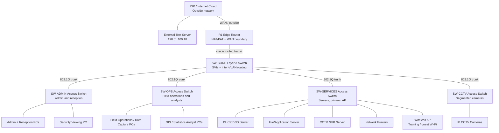

# Physical Topology

Project name: **Stats SA Mafikeng Field Office (Mahikeng)**

## Physical Layout

## Packet Tracer Device Inventory

| Device name | Packet Tracer device type | Quantity | Role |
| --- | --- | --- | --- |
| R1 | ISR router, for example Cisco 2911 | 1 | Edge router, default route, NAT inside/outside boundary. |
| SW-CORE | Multilayer switch, for example Cisco 3560 | 1 | VLAN gateways, inter-VLAN routing, ACL enforcement. |
| SW-ADMIN | Access switch, for example Cisco 2960 | 1 | Administration, reception, and security viewing hosts. |
| SW-OPS | Access switch, for example Cisco 2960 | 1 | Field operations, data capture, GIS, and statistics users. |
| SW-SERVICES | Access switch, for example Cisco 2960 | 1 | Servers, printers, and wireless AP. |
| SW-CCTV | Access switch, for example Cisco 2960 | 1 | CCTV camera access ports. |
| DHCP/DNS server | Packet Tracer server | 1 | DHCP scopes and DNS services. |
| File/application server | Packet Tracer server | 1 | Simulated internal office services. |
| NVR server | Packet Tracer server | 1 | CCTV recording endpoint. |
| Wireless AP | Packet Tracer wireless AP | 1 | Training/guest wireless access. |
| PCs/laptops | Packet Tracer end devices | As needed | Staff, analysts, admin, and test hosts. |
| IP cameras | Packet Tracer camera/end devices | 4 baseline | CCTV change request. |
| Printers | Packet Tracer printers | 2 baseline | Shared printing. |

## Link and Port Plan

| Link | Type | Purpose |
| --- | --- | --- |
| ISP cloud/router to R1 | Routed WAN link | Simulates the outside network. |
| R1 to SW-CORE | Routed internal transit link | Carries traffic from the LAN to the NAT edge. |
| SW-CORE to each access switch | 802.1Q trunk | Carries required VLANs to the access layer. |
| Access switch to PC/printer/camera/server | Access link | Places each endpoint in the correct VLAN. |
| SW-SERVICES to wireless AP | Access link or trunk, depending on AP model | Provides training/guest wireless access. |

## Physical Design Justification

This layout is intentionally practical. A government field office does not need an overcomplicated enterprise core, but it does need a network that can be explained, tested, and secured. The core/access structure gives the office a clear physical layout: traffic moves from endpoint switches to SW-CORE, then to R1 when it needs outside access.

The CCTV access switch is kept separate because the client specifically requested segmented CCTV traffic. In a real building this also makes sense physically: cameras are often placed around entrances, corridors, and public areas, and grouping them helps with cabling, power, and troubleshooting.

NAT is placed on R1 because that is the natural inside/outside boundary. SW-CORE stays focused on internal routing and VLAN policy, which makes the Packet Tracer implementation easier to verify during demonstrations.

## Physical Review Strengths

- All major devices are named and assigned a purpose.
- Physical links show the difference between WAN, routed transit, trunks, and access ports.
- The topology includes the CCTV change request as part of the main design.
- The design is realistic enough for a field office but still manageable in Packet Tracer.
- The device inventory can be used directly when building the `.pkt` file.
