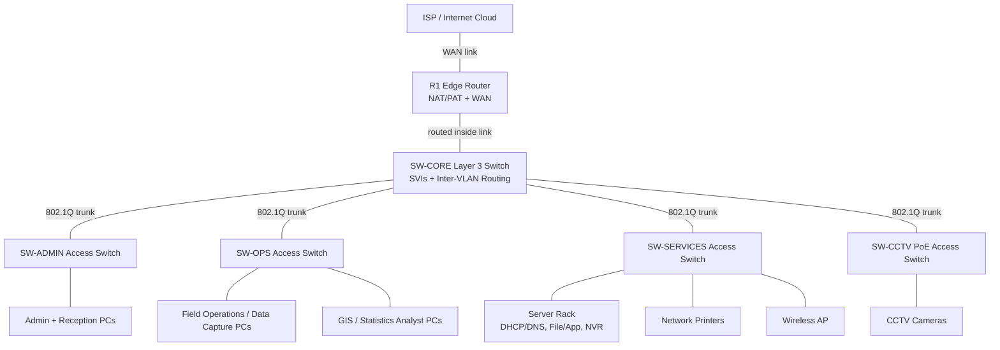

# Physical Topology

## Proposed Physical Layout

## Device Roles

| Device | Role |
| --- | --- |
| ISP / Internet Cloud | Simulates the outside network and external test services. |
| R1 Edge Router | Provides WAN connectivity, NAT/PAT, default route handling, and inside/outside boundary. |
| SW-CORE Layer 3 Switch | Provides VLAN gateways, inter-VLAN routing, and routing toward R1. |
| SW-ADMIN | Connects administration and reception workstations. |
| SW-OPS | Connects field operations, data capture, GIS, and statistics workstations. |
| SW-SERVICES | Connects servers, printers, and wireless APs. |
| SW-CCTV | Connects CCTV cameras on a dedicated segmented VLAN. |
| Servers | Provide DHCP, DNS, file/application services, and CCTV NVR services. |

## Cabling Plan

- R1 to ISP: routed WAN link.
- R1 to SW-CORE: routed inside transit link.
- SW-CORE to access switches: Ethernet trunk links carrying required VLANs.
- User PCs, printers, servers, APs, and cameras: Ethernet access links.
- CCTV cameras and wireless APs should use PoE-capable access ports in the real-world design; Packet Tracer can simulate the logical behavior.

## Physical Design Justification

- The core/access layout is simple enough for Packet Tracer while still matching a realistic field-office design.
- Inter-VLAN routing is centralized on the Layer 3 core switch.
- NAT remains at the edge router, clearly separating inside and outside networks.
- CCTV has its own access switch and VLAN, making the change request visible in both physical and logical designs.
- The layout leaves room to add more PCs, cameras, or services in later milestones.

