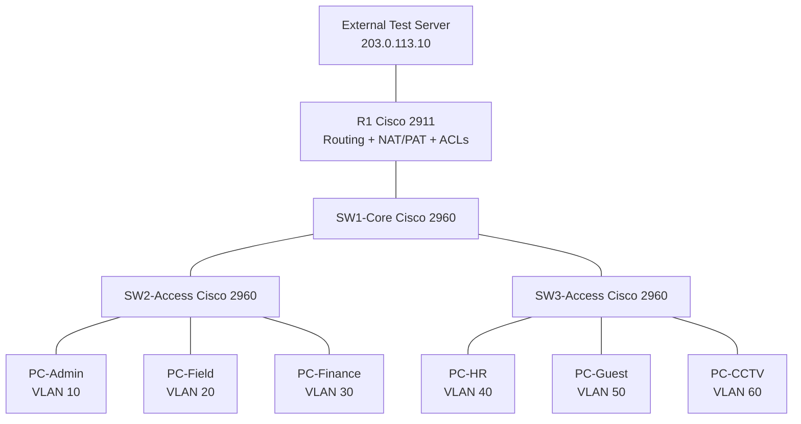

# Logical Topology

## Architecture

The implemented network uses **router-on-a-stick** inter-VLAN routing on R1. SW1-Core aggregates SW2-Access and SW3-Access through 802.1Q trunks. Endpoints connect to access ports assigned to their functional VLANs.

## VLAN and Routing Model

| VLAN | Security / business zone | Gateway |
| ---: | --- | --- |
| 10 | Administration | `192.168.10.1` |
| 20 | Field | `192.168.20.1` |
| 30 | Finance | `192.168.30.1` |
| 40 | Human Resources | `192.168.40.1` |
| 50 | Guest | `192.168.50.1` |
| 60 | CCTV | `192.168.60.1` |
| 99 | Infrastructure management | `192.168.99.1` |

R1 terminates the VLANs as 802.1Q subinterfaces on `GigabitEthernet0/1`. The external interface `GigabitEthernet0/0` is `203.0.113.1`.

## Security Policy

| Source | Destination | Policy |
| --- | --- | --- |
| Guest VLAN 50 | Admin, Field, Finance, HR, CCTV, management | Deny |
| Guest VLAN 50 | External test network | Permit |
| CCTV VLAN 60 | Admin, Field, Finance, HR, Guest, management | Deny |
| CCTV VLAN 60 | External test network | Permit |
| Authorized Admin | Switch management addresses | Permit SSH |

The inbound `GUEST-ISOLATION` and `CCTV-ISOLATION` ACLs enforce these restrictions on R1. Behavioral tests and ACL counters confirmed both deny and permit paths.

## NAT/PAT

R1 provides the simulated edge translation service. Internal business VLANs are classified as NAT inside; `GigabitEthernet0/0` is NAT outside. Verification showed active dynamic translations and non-zero NAT hit counters.

## Management Plane

VLAN 99 separates infrastructure management from user networks. The switch management addresses are:

- SW1-Core — `192.168.99.2`
- SW2-Access — `192.168.99.3`
- SW3-Access — `192.168.99.4`

SSH is used for remote management. PC-Admin successfully established an SSH session to SW1-Core during testing.

## Design Boundary

This logical topology documents the Packet Tracer implementation actually built and tested. Production deployment would additionally require enterprise firewalling, centralized AAA, monitoring/logging, configuration backups, redundancy, and an approved organizational addressing plan.
